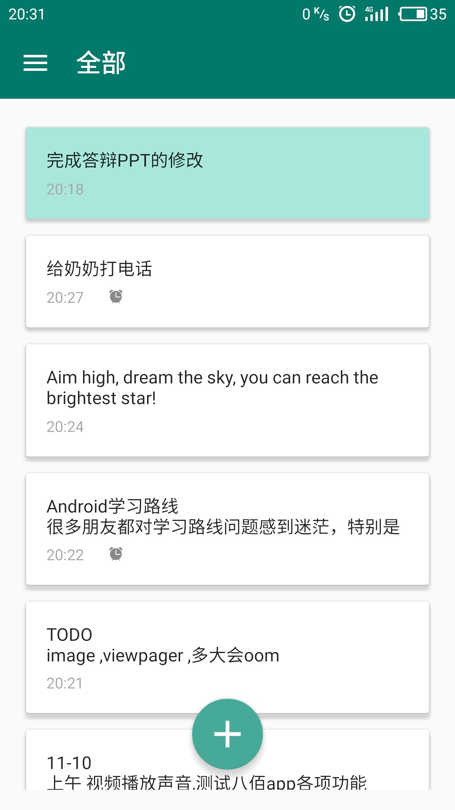
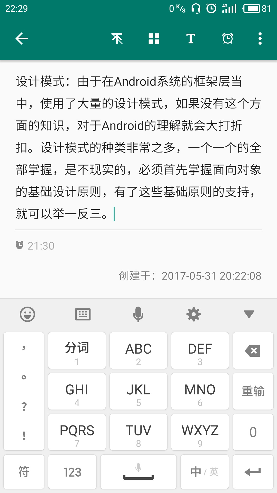
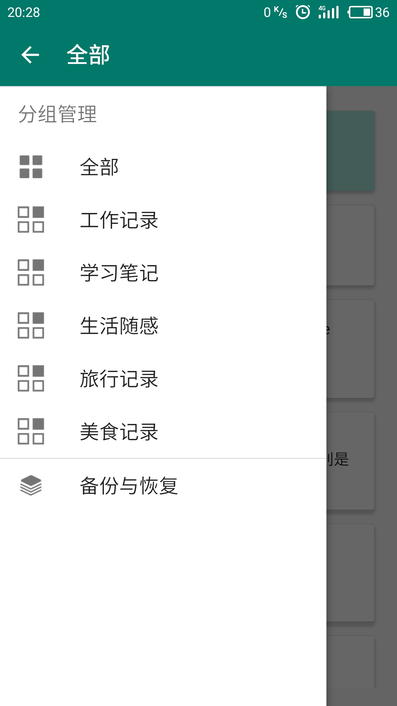
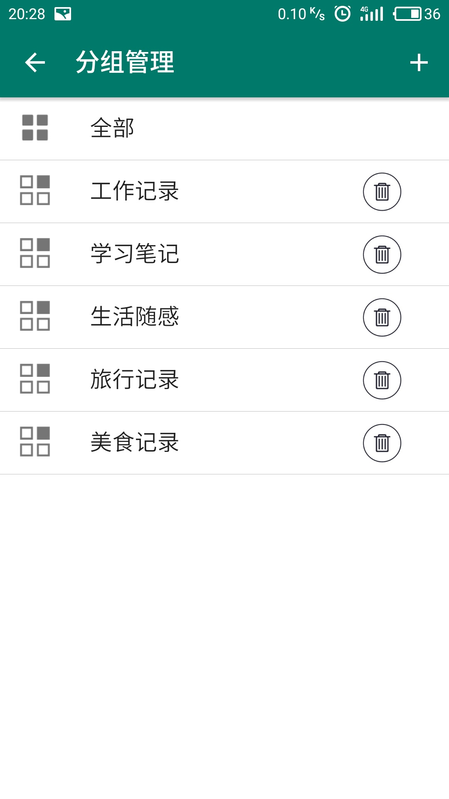
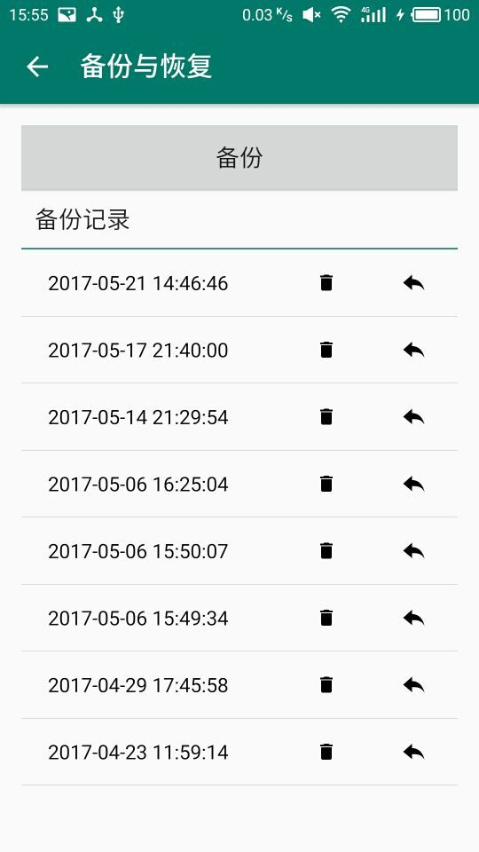
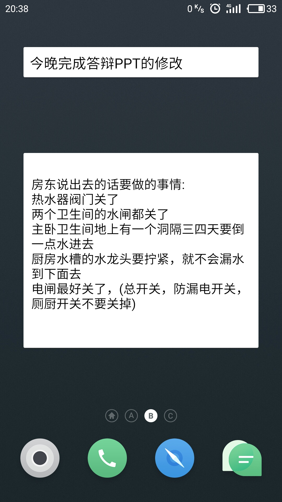
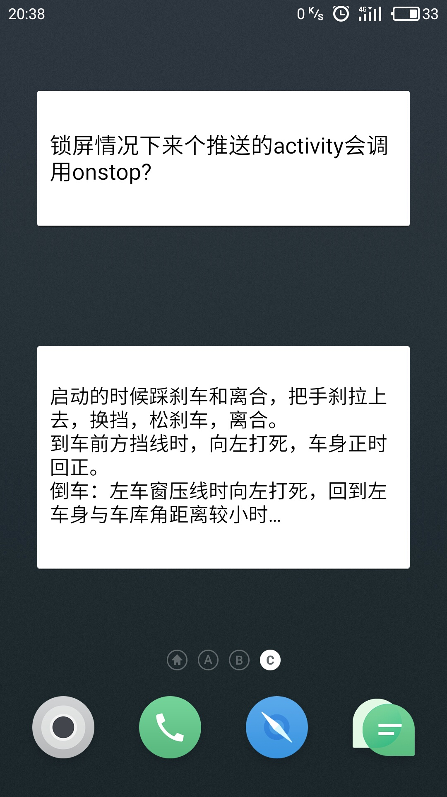

# MyMemos
MyMemos是一款本地记录的便签App。便签的数据存储在数据库中，备份与恢复便签是对数据库文件进行写入和读取，分享便签调用系统分享接口，通过设置数据库中表的字段保存状态值，实现便签的分组、置顶、设置字体等操作。AlarmManager定时发送通知实现便签提醒。参考NavigationView源码实现符合Material Design规范的侧边栏菜单，同时也具备动态修改菜单条目的特性。Widget实现桌面小工具，通过WidgetId绑定一个数据库中存储的便签，实现便签内容在App内与桌面Widget的同步修改。

主要界面截图如下：

  
  
  
  
